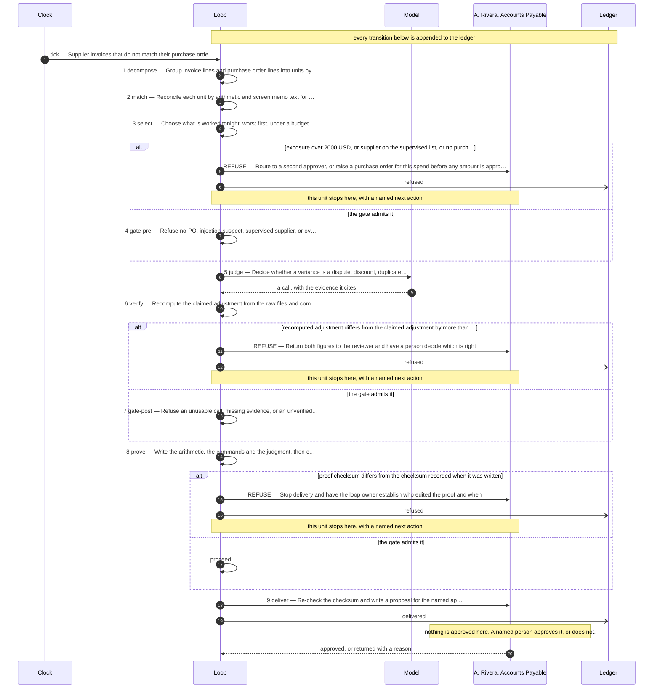
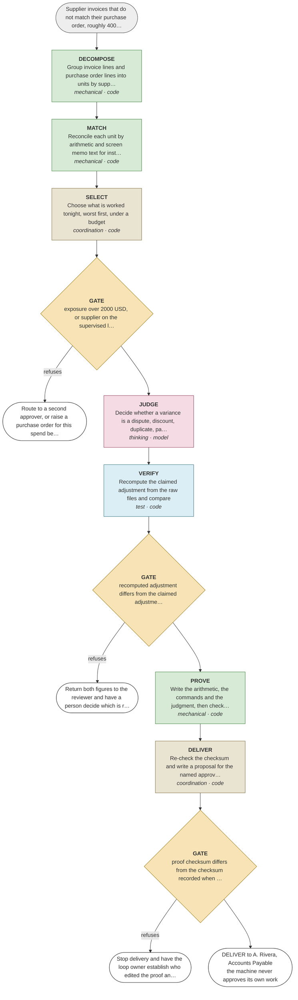

# Supplier invoices that do not match their purchase order, roughly 400 a month

A proposed design. **Nothing here is decided.** Read the assumptions first — they are
the gaps that were filled to produce this, and each one is a question for you.

## Assumptions made to produce this design

- Invoice and purchase order lines are retrievable from the ERP as structured records
- A supplier reusing a purchase order number across periods is out of scope for now
- Tolerance limits are set by finance policy and reviewed quarterly
- The supervised supplier list is maintained by the contract owner, not by this loop

## The unit of work

**One (supplier, purchase order) pair**

| | |
|---|---|
| Rule or judgment | rule |
| The two-people test | Two buyers given the same two files, unable to confer, produce the same units |
| How many run at once | 7 — Bounded by what one approver reads in a morning, not by machine capacity |

## The steps

| # | Step | Type | Who | Runs | What it does |
|---|---|---|---|---|---|
| 1 | decompose | mechanical | code | batch | Group invoice lines and purchase order lines into units by supplier and order |
| 2 | match | mechanical | code | batch | Reconcile each unit by arithmetic and screen memo text for instructions |
| 3 | select | coordination | code | batch | Choose what is worked tonight, worst first, under a budget |
| 4 | gate-pre | gate | code | unit | Refuse no-PO, injection-suspect, supervised supplier, or over the cap |
| 5 | judge | thinking | model | unit | Decide whether a variance is a dispute, discount, duplicate, partial or typo |
| 6 | verify | test | code | unit | Recompute the claimed adjustment from the raw files and compare |
| 7 | gate-post | gate | code | unit | Refuse an unusable call, missing evidence, or an unverified adjustment |
| 8 | prove | mechanical | code | unit | Write the arithmetic, the commands and the judgment, then checksum it |
| 9 | deliver | coordination | code | unit | Re-check the checksum and write a proposal for the named approver |

**One judgment, and this is it:** step 5, judge — Decide whether a variance is a dispute, discount, duplicate, partial or typo

Everything else is a rule. If that step were removed entirely, the rest of this loop
still partitions the work, refuses what it should refuse, and proves what it did.

## Where it refuses

| After step | The condition | The next human action |
|---|---|---|
| 4 | exposure over 2000 USD, or supplier on the supervised list, or no purchase order exists | Route to a second approver, or raise a purchase order for this spend before any amount is approved |
| 7 | recomputed adjustment differs from the claimed adjustment by more than 0.01 | Return both figures to the reviewer and have a person decide which is right |
| 9 | proof checksum differs from the checksum recorded when it was written | Stop delivery and have the loop owner establish who edited the proof and when |

## What a human approves from

Written by step 8, which is a mechanical step — a model never
writes the evidence it will be judged on.

- **Contains:** The invoice as filed, the purchase order as raised, the arithmetic, the judgment, and the checks that ran
- **Integrity:** SHA-256 recorded at write time and re-checked at delivery; a mismatch blocks delivery
- **Approver:** A. Rivera, Accounts Payable
- **Exit criterion:** Shut down if review minutes per unit exceeds 4 for two consecutive weeks

## How it is governed

| KPI | Kind | Baseline today |
|---|---|---|
| cost per completed decision | cost | unmeasured |
| escaped defect rate | quality | 0 known in the last quarter |
| review minutes per unit | throughput | 9 minutes manual |
| refusal rate | control | not applicable before this loop |

## What happens next

1. **Discuss it.** Every assumption above is a question, and the unit boundary is the
   one worth arguing about — everything downstream inherits it.
2. **Change it.** Edit the design file and re-run the validator. That is cheap now and
   expensive later.
3. **Accept it**, by name, when it is right: `make accept DESIGN=<design> BY="Name, Role"`
4. **Build it:** `make scaffold DESIGN=<design> NAME=<name>` — it runs the same day.

## The flow it proposes

Pictures, for reading: [`diagrams/sequence.svg`](diagrams/sequence.svg) and
[`diagrams/flow.svg`](diagrams/flow.svg). Open either one — no tooling needed.

### Step by step, with every gate

### The same design as a flowchart, coloured by the kind of step

Green is a rule. Pink is the judgment. Amber is a gate. Blue is a check.

