# Accelerate purchase requisition approval by automating screening, routing, and policy verification to reduce finance team review time from 5 to 2 business days

A proposed design. **Nothing here is decided.** Read the assumptions first — they are
the gaps that were filled to produce this, and each one is a question for you.

## Assumptions made to produce this design

- Approval thresholds documented: <$5K auto-approve if compliant; $5K-$50K manager approval; >$50K Finance Manager/CFO approval
- Policy compliance rules defined: approved vendor whitelist, budget availability, category restrictions, compliance holds
- Vendor and budget data queryable real-time from ERP accounting system
- Requisitions arrive in structured format with: amount, vendor, cost center, business purpose, requestor, date
- Current baseline cycle time 5 business days; target is 2 business days
- Rejected requisitions can be resubmitted with corrections
- Auto-approval threshold for tier 1 is < $5K with no compliance flags
- Error rate baseline is unmeasured

## The unit of work

**One purchase requisition with all required fields, ready for approval routing and decision**

| | |
|---|---|
| Rule or judgment | rule |
| The two-people test | Two operators would identify and classify each requisition identically by amount tier and compliance status using documented thresholds |
| How many run at once | 150 — ~150 requisitions per week; batch processing daily at ~30 per day within finance team capacity |

## The steps

| # | Step | Type | Who | Runs | What it does |
|---|---|---|---|---|---|
| 1 | Retrieve pending | mechanical | code | batch | Query pending requisitions from submission system; deduplicate by requisition ID |
| 2 | Normalize format | mechanical | code | batch | Parse requisition data into standard schema; convert amounts to decimal; validate date formats |
| 3 | Field validation | mechanical | code | batch | Verify all required fields present (amount, vendor, cost center, purpose, requestor, date) |
| 4 | Vendor check | mechanical | code | batch | Query vendor name against approved vendor whitelist; flag non-whitelisted vendors |
| 5 | Budget check | mechanical | code | batch | Query cost center available budget; flag if requested amount exceeds available funds |
| 6 | Compliance screening | mechanical | code | batch | Check vendor against blacklist, category against restricted categories, and compliance holds |
| 7 | Tier assignment | mechanical | code | batch | Classify by amount tier: tier 1 (<$5K), tier 2 ($5K-$50K), tier 3 (>$50K); flag violations for manual routing |
| 8 | Compliance gate | gate | code | unit | Reject if: required field missing, amount ≤ $0, amount > $999,999, vendor non-whitelisted, budget insufficient, or compliance violation found |
| 9 | Auto-approval | mechanical | code | unit | Approve all tier 1 compliant requisitions (<$5K, no violations); create approval record; notify requestor |
| 10 | Route for review | mechanical | code | unit | Route tier 2 to department manager; route tier 3 and violations to Finance Manager; set 24-hour review SLA |
| 11 | Manager review | thinking | human | unit | For tier 2 and violations: evaluate business purpose legitimacy against budget allocation and policy; determine approval decision |
| 12 | Decision verification | test | code | unit | Independently verify decision aligns with amount tier authority limits and documented approval policy |
| 13 | Policy gate | gate | code | unit | Reject if: decision contradicts approver authority for tier, business purpose < 50 characters, or policy violation unaddressed |
| 14 | Record approval | mechanical | code | unit | Write approval audit record: req ID, amount, vendor, cost center, decision, approver role, timestamp, business purpose, checksum |
| 15 | Notify requestor | coordination | code | unit | Send approval/rejection notification; route approved items to procurement system; mark rejections for resubmission |

**One judgment, and this is it:** step 11, Manager review — For tier 2 and violations: evaluate business purpose legitimacy against budget allocation and policy; determine approval decision

Everything else is a rule. If that step were removed entirely, the rest of this loop
still partitions the work, refuses what it should refuse, and proves what it did.

## Where it refuses

| After step | The condition | The next human action |
|---|---|---|
| 8 | required field missing OR amount ≤ $0 OR amount > $999,999 OR vendor non-whitelisted OR budget unavailable OR compliance violation (blacklist, category restriction, or procurement hold) | Requestor must resubmit: provide missing fields, switch to approved vendor, obtain budget increase from cost center owner, or request policy exception from Finance Manager |
| 13 | decision contradicts approver authority for amount tier OR business purpose < 50 characters OR policy violation flagged but unaddressed in decision | Return to approver with specific notes; requestor may resubmit with expanded business purpose (≥50 characters) or appeal to next authority level (Director/CFO) |

## What a human approves from

Written by step 14, which is a mechanical step — a model never
writes the evidence it will be judged on.

- **Contains:** Approval audit record containing: requisition ID, amount, vendor, cost center, approval decision (tier 1 auto-approved, manager-approved, CFO-approved, rejected), approver identity and role, timestamp, full business purpose text, all policy flags identified, checksum of record
- **Integrity:** Record checksummed at write time; immutable after creation; hash validation on read; all modifications logged with user ID, timestamp, and modification reason; quarterly sample audit against documented policy
- **Approver:** Finance Manager
- **Exit criterion:** Average cycle time ≤ 2 business days; 60% of requisitions auto-approved without manual review

## How it is governed

| KPI | Kind | Baseline today |
|---|---|---|
| Cycle time | throughput | 5 business days baseline; target ≤ 2 business days |
| Cost per approval | cost | unmeasured (estimate: tier 1 ≈$0 auto cost; tier 2 ≈$30 manager time; tier 3 ≈$50 Finance Manager time) |
| Approval accuracy | quality | 95% baseline (% of approvals with no policy violations derived from audit sample) |
| Auto-approval rate | control | target 60% of requisition volume (tier 1 compliant items) |
| Exception rate | control | target < 5% of volume (policy variances requiring exception approval) |

## What happens next

1. **Discuss it.** Every assumption above is a question, and the unit boundary is the
   one worth arguing about — everything downstream inherits it.
2. **Change it.** Edit the design file and re-run the validator. That is cheap now and
   expensive later.
3. **Accept it**, by name, when it is right: `tooling/accept.sh <design> --by "Name, Role"`
4. **Build it:** `tooling/scaffold.sh <design> loops/<name>` — it runs the same day.

## The flow it proposes

Pictures, for reading: [`diagrams/sequence.svg`](diagrams/sequence.svg) and
[`diagrams/flow.svg`](diagrams/flow.svg). Open either one — no tooling needed.

### Step by step, with every gate

```mermaid
%% Generated by render.sh from the design. Do not edit by hand —
%% edit the design and render again. This diagram cannot disagree with it.
sequenceDiagram
    autonumber
    participant C as Clock
    participant L as Loop
    participant X as Expert
    participant H as Finance Manager
    participant G as Ledger

    Note over L,G: every transition below is appended to the ledger
    C->>L: tick — Accelerate purchase requisition approval by automating …

    L->>L: 1 Retrieve pending — Query pending requisitions from submission system deduplica…
    L->>L: 2 Normalize format — Parse requisition data into standard schema convert amounts…
    L->>L: 3 Field validation — Verify all required fields present (amount, vendor, cost ce…
    L->>L: 4 Vendor check — Query vendor name against approved vendor whitelist flag no…
    L->>L: 5 Budget check — Query cost center available budget flag if requested amount…
    L->>L: 6 Compliance screening — Check vendor against blacklist, category against restricted…
    L->>L: 7 Tier assignment — Classify by amount tier: tier 1 (<$5K), tier 2 ($5K-$50K), …
    alt required field missing OR amount ≤ $0 OR amount > $999,999 OR vendor …
        L->>H: REFUSE — Requestor must resubmit: provide missing fields, switch to approved vendor, obtain budget incre…
        L-)G: refused
        Note over L,H: this unit stops here, with a named next action
    else the gate admits it
        L->>L: 8 Compliance gate — Reject if: required field missing, amount ≤ $0, amount > …
    end
    L->>L: 9 Auto-approval — Approve all tier 1 compliant requisitions (<$5K, no violati…
    L->>L: 10 Route for review — Route tier 2 to department manager route tier 3 and violati…
    L->>X: 11 Manager review — For tier 2 and violations: evaluate business purpose legiti…
    X-->>L: a call, with the evidence they cite
    L->>L: 12 Decision verification — Independently verify decision aligns with amount tier autho…
    alt decision contradicts approver authority for amount tier OR business pur…
        L->>H: REFUSE — Return to approver with specific notes requestor may resubmit with expanded business purpose (â…
        L-)G: refused
        Note over L,H: this unit stops here, with a named next action
    else the gate admits it
        L->>L: 13 Policy gate — Reject if: decision contradicts approver authority for tier…
    end
    L->>L: 14 Record approval — Write approval audit record: req ID, amount, vendor, cost c…
    L->>H: 15 Notify requestor — Send approval/rejection notification route approved items t…
    L-)G: delivered
    Note over H: nothing is approved here. A named person approves it, or does not.
    H-->>L: approved, or returned with a reason
```

### The same design as a flowchart, coloured by the kind of step

Green is a rule. Pink is the judgment. Amber is a gate. Blue is a check.

```mermaid
%% Generated by render.sh from the design. Do not edit by hand.
flowchart TB
    IN(["Accelerate purchase requisition approval by automating screening, rou…"]):::io
    S1["<b>RETRIEVE PENDING</b><br/>Query pending requisitions from submission system deduplicate b…<br/><i>mechanical · code</i>"]:::mech
    IN --> S1
    S2["<b>NORMALIZE FORMAT</b><br/>Parse requisition data into standard schema convert amounts to …<br/><i>mechanical · code</i>"]:::mech
    S1 --> S2
    S3["<b>FIELD VALIDATION</b><br/>Verify all required fields present amount, vendor, cost center,…<br/><i>mechanical · code</i>"]:::mech
    S2 --> S3
    S4["<b>VENDOR CHECK</b><br/>Query vendor name against approved vendor whitelist flag non-wh…<br/><i>mechanical · code</i>"]:::mech
    S3 --> S4
    S5["<b>BUDGET CHECK</b><br/>Query cost center available budget flag if requested amount exc…<br/><i>mechanical · code</i>"]:::mech
    S4 --> S5
    S6["<b>COMPLIANCE SCREENING</b><br/>Check vendor against blacklist, category against restricted cat…<br/><i>mechanical · code</i>"]:::mech
    S5 --> S6
    S7["<b>TIER ASSIGNMENT</b><br/>Classify by amount tier: tier 1 <$5K, tier 2 $5K-$50K, tier 3 >…<br/><i>mechanical · code</i>"]:::mech
    S6 --> S7
    S8{"<b>GATE</b><br/>required field missing OR amount ≤ $0 OR amount > $99…"}:::gate
    S7 --> S8
    S8 -- refuses --> H1(["Requestor must resubmit: provide missing fields, switch to approved ven…"]):::out
    H1:::out
    S9["<b>AUTO-APPROVAL</b><br/>Approve all tier 1 compliant requisitions <$5K, no violations c…<br/><i>mechanical · code</i>"]:::mech
    S8 --> S9
    S10["<b>ROUTE FOR REVIEW</b><br/>Route tier 2 to department manager route tier 3 and violations …<br/><i>mechanical · code</i>"]:::mech
    S9 --> S10
    S11["<b>MANAGER REVIEW</b><br/>For tier 2 and violations: evaluate business purpose legitimacy…<br/><i>thinking · human</i>"]:::think
    S10 --> S11
    S12["<b>DECISION VERIFICATION</b><br/>Independently verify decision aligns with amount tier authority…<br/><i>test · code</i>"]:::test
    S11 --> S12
    S13{"<b>GATE</b><br/>decision contradicts approver authority for amount tier…"}:::gate
    S12 --> S13
    S13 -- refuses --> H2(["Return to approver with specific notes requestor may resubmit with expa…"]):::out
    H2:::out
    S14["<b>RECORD APPROVAL</b><br/>Write approval audit record: req ID, amount, vendor, cost cente…<br/><i>mechanical · code</i>"]:::mech
    S13 --> S14
    S15["<b>NOTIFY REQUESTOR</b><br/>Send approval/rejection notification route approved items to pr…<br/><i>coordination · code</i>"]:::coord
    S14 --> S15
    S15 --> OUT(["DELIVER to Finance Manager<br/>the machine never approves its own work"]):::out
    classDef mech fill:#d6ead6,stroke:#3a7d3a
    classDef coord fill:#e9e3d2,stroke:#7a6a3a
    classDef think fill:#f5dbe4,stroke:#8f3754
    classDef test fill:#dceef5,stroke:#2d6d80
    classDef gate fill:#f7e3b5,stroke:#9c7b1a
    classDef io fill:#eee,stroke:#555
    classDef out fill:#fff,stroke:#333
```

