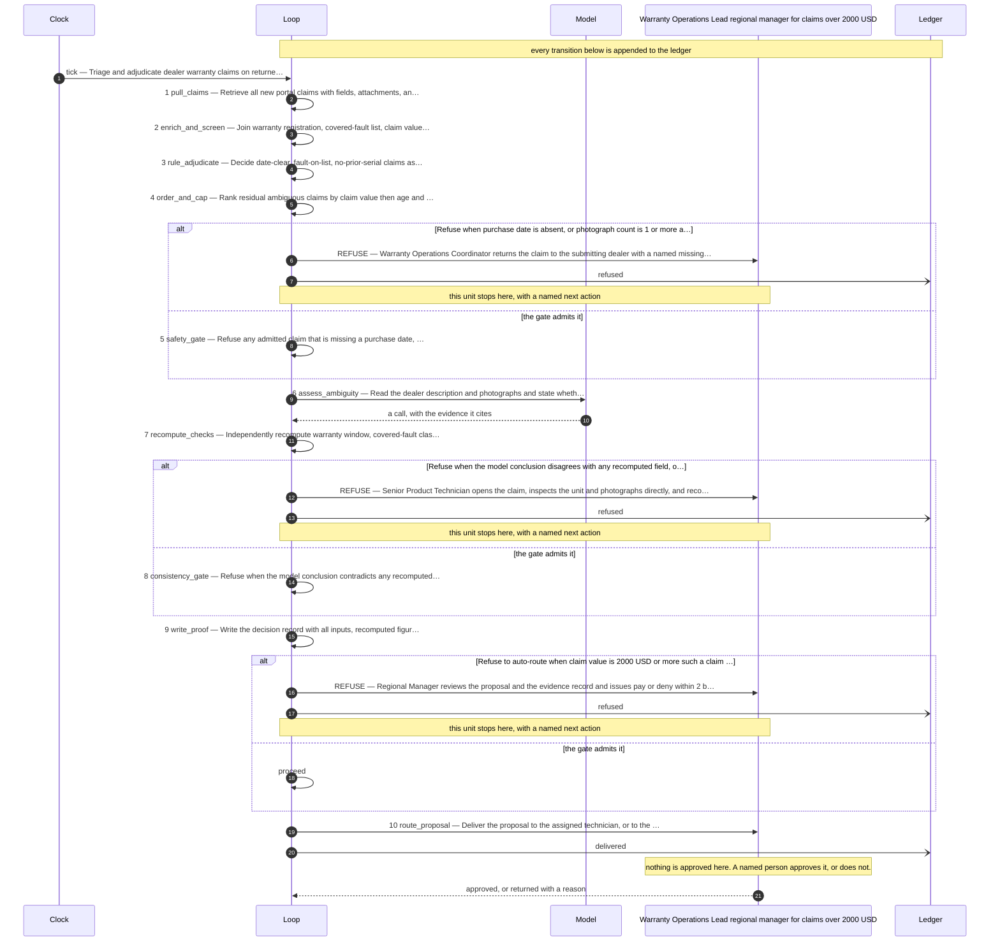

# Triage and adjudicate dealer warranty claims on returned hardware, routing only genuinely ambiguous claims to a product expert.

A proposed design. **Nothing here is decided.** Read the assumptions first — they are
the gaps that were filled to produce this, and each one is a question for you.

## Assumptions made to produce this design

- The dealer portal exposes each claim as a record with claim number, serial, dealer id, fault description text, purchase date, submission date, and zero or more photograph attachments, retrievable by query.
- A serial-to-warranty-registration table exists and gives sale date and warranty term per serial; warranty window is computed as purchase date plus term.
- A written covered-fault list exists and can be encoded as a keyword-and-category mapping; wear-and-tear exclusions are on the same list.
- Claim value is available at submission time, or is computed from a parts-and-labor price table keyed by fault category; assumed available before adjudication.
- Assumed a duplicate-claim check keyed on serial across all historical claims regardless of claim number, since the two known double-payment incidents used different claim numbers on the same serial.
- Assumed a single-approver cap of 2000 USD, taken directly from the description; claims at or above this route to the regional manager.
- Assumed the "roughly one in six" hard-claim rate (approximately 17 percent) as the expected referral baseline, giving about 42 of 250 monthly claims.
- Assumed photographs are machine-retrievable image files, and that impact-damage assessment from photographs is a judgment a rule cannot make.
- Assumed dealer-written fault descriptions are untrusted external text and must be screened before any model reads them.
- Assumed a monthly volume of 250 claims and a working cap of 60 model-assessed claims per month, above the 42 expected, to absorb variance without unbounded spend.
- Assumed technicians remain in the loop as the approving humans; the loop proposes, it does not pay.
- Assumed no instruction embedded in a dealer description is ever executed; none was observed in the supplied text.

## The unit of work

**One warranty claim, identified by claim number, for one serial number.**

| | |
|---|---|
| Rule or judgment | rule |
| The two-people test | Two technicians given the same portal export produce the same list of claims, because the portal assigns one claim number per submission and no splitting or merging judgment is involved. |
| How many run at once | 60 — Expected 42 ambiguous claims per month (one in six of 250) plus headroom; the cap bounds monthly model spend and forces overflow into the technician queue rather than silent growth. |

## The steps

| # | Step | Type | Who | Runs | What it does |
|---|---|---|---|---|---|
| 1 | pull_claims | mechanical | code | batch | Retrieve all new portal claims with fields, attachments, and submission timestamps into a normalized record set |
| 2 | enrich_and_screen | mechanical | code | batch | Join warranty registration, covered-fault list, claim value, and prior-claim history per serial; strip control characters and flag instruction-like text in dealer descriptions |
| 3 | rule_adjudicate | mechanical | code | batch | Decide date-clear, fault-on-list, no-prior-serial claims as approve, and out-of-window or excluded-fault claims as deny, with the deciding figures recorded |
| 4 | order_and_cap | coordination | code | batch | Rank residual ambiguous claims by claim value then age and admit at most 60 to model assessment; the remainder go to the technician queue |
| 5 | safety_gate | gate | code | unit | Refuse any admitted claim that is missing a purchase date, has an unreadable photograph, or carries a screening flag from step 2 |
| 6 | assess_ambiguity | thinking | model | unit | Read the dealer description and photographs and state whether the described fault is a covered fault, whether the photographs show impact damage not mentioned, and the reasoning |
| 7 | recompute_checks | test | code | unit | Independently recompute warranty window, covered-fault classification, duplicate-serial status, and claim value from source records without using the model output |
| 8 | consistency_gate | gate | code | unit | Refuse when the model conclusion contradicts any recomputed check, when duplicate-serial count is 1 or more, or when the model cites no photograph for an impact-damage claim |
| 9 | write_proof | mechanical | code | unit | Write the decision record with all inputs, recomputed figures, model text, gate outcomes, and a SHA-256 checksum |
| 10 | route_proposal | coordination | code | unit | Deliver the proposal to the assigned technician, or to the regional manager when claim value is 2000 USD or more |

**One judgment, and this is it:** step 6, assess_ambiguity — Read the dealer description and photographs and state whether the described fault is a covered fault, whether the photographs show impact damage not mentioned, and the reasoning

Everything else is a rule. If that step were removed entirely, the rest of this loop
still partitions the work, refuses what it should refuse, and proves what it did.

## Where it refuses

| After step | The condition | The next human action |
|---|---|---|
| 5 | Refuse when purchase date is absent, or photograph count is 1 or more and readable photograph count is less than photograph count, or the instruction-flag count is 1 or more | Warranty Operations Coordinator returns the claim to the submitting dealer with a named missing-field request and a 5-business-day response window |
| 8 | Refuse when the model conclusion disagrees with any recomputed field, or duplicate-serial count is 1 or more, or an impact-damage finding cites zero photographs | Senior Product Technician opens the claim, inspects the unit and photographs directly, and records a written adjudication in the claim record |
| 10 | Refuse to auto-route when claim value is 2000 USD or more; such a claim is never delivered to a technician for final approval | Regional Manager reviews the proposal and the evidence record and issues pay or deny within 2 business days |

## What a human approves from

Written by step 9, which is a mechanical step — a model never
writes the evidence it will be judged on.

- **Contains:** Claim number, serial, dealer id, purchase date, warranty window computed, fault classification, duplicate-serial hits with their claim numbers, claim value, photograph hashes, model assessment text verbatim, recomputed check results, every gate outcome, and the final routing target.
- **Integrity:** Each record is SHA-256 checksummed over its canonical serialization, the checksum is chained to the prior record's checksum, and a nightly cron re-verifies the chain; any mismatch alerts the Warranty Operations Lead.
- **Approver:** Warranty Operations Lead (regional manager for claims over 2000 USD)
- **Exit criterion:** Shut down the loop if expert-review referral rate exceeds 30 percent of claims for two consecutive months, or if reversal rate on auto-approved claims exceeds 2 percent.

## How it is governed

| KPI | Kind | Baseline today |
|---|---|---|
| cost_per_claim_decided | cost | unmeasured |
| model_spend_per_month | cost | unmeasured |
| auto_approval_reversal_rate | quality | unmeasured |
| duplicate_serial_payments | control | 2 known incidents to date |
| days_submission_to_decision | throughput | 8 days |
| expert_referral_rate | quality | approximately 17 percent assumed |
| claims_decided_without_model | throughput | unmeasured |

## What happens next

1. **Discuss it.** Every assumption above is a question, and the unit boundary is the
   one worth arguing about — everything downstream inherits it.
2. **Change it.** Edit the design file and re-run the validator. That is cheap now and
   expensive later.
3. **Accept it**, by name, when it is right: `tooling/accept.sh <design> --by "Name, Role"`
4. **Build it:** `tooling/scaffold.sh <design> loops/<name>` — it runs the same day.

## The flow it proposes

