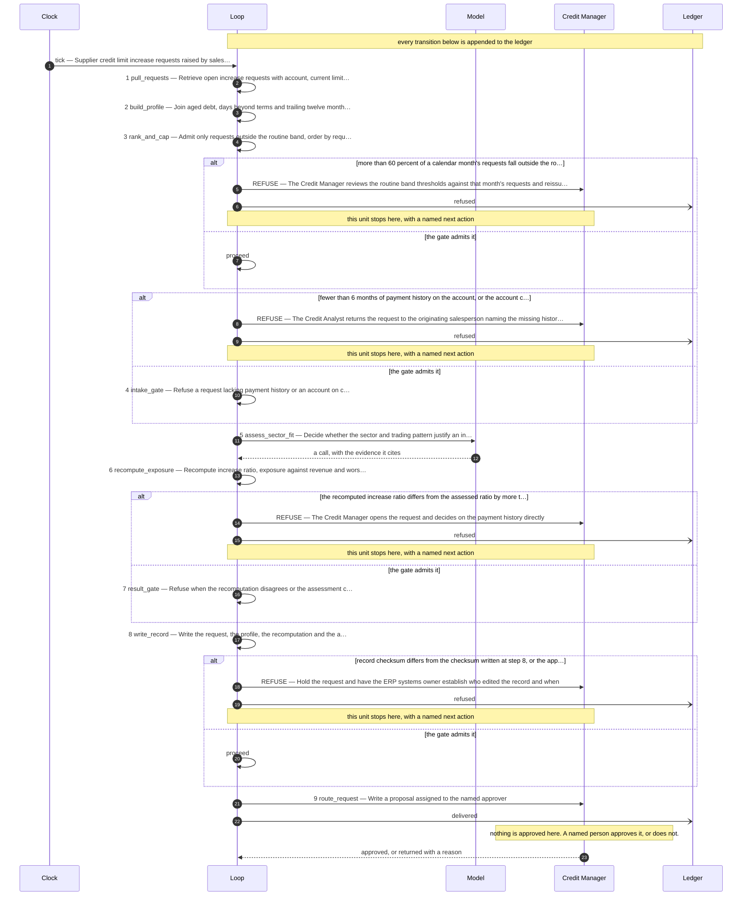

# The design this loop was built from

**Use case:** Supplier credit limit increase requests raised by sales, about sixty a month, each asking to raise one customer's credit limit

| | |
|---|---|
| Unit of work | One credit limit increase request for one customer account |
| Approver | Credit Manager |
| Fan-out | 8 |
| Exit criterion | Shut down if approved increases that go to write-off exceeds 3 in any rolling six months |

## Assumptions this design rests on

- The ERP exposes each request with the customer account number, the current limit, the requested limit and the sales justification text by query
- Payment history is available as structured aged-debt and days-beyond-terms figures per customer, not as a narrative
- Customer size is available as trailing twelve month billed revenue on the customer account; this is the denominator used to judge whether an increase is large relative to the customer
- Assumed a routine band of a requested increase at or below 25 percent of the current limit and at or below 10 percent of trailing twelve month revenue; confirm with the Credit Manager
- Assumed a single-approver cap of 250000 USD on the resulting limit, above which the Finance Director countersigns; confirm with finance
- Assumed the sector knowledge the hard cases need is held by the Credit Manager and a sector risk note, and that the loop proposes rather than decides
- Assumed no external credit bureau feed is available in the first version, so the loop reasons only on internal payment history
- The sales justification is externally written text and is screened before it reaches any model
- Assumed the five day figure is calendar days from request submission to analyst decision, measured in the ERP timestamps
- Assumed requests inside the routine band are decided by the existing ERP limit rule outside this loop and never enter it, leaving roughly twenty of the sixty a month as the judgment population; confirm the split with the Credit Manager
- Assumed the routine band thresholds are reviewed monthly, because a band that drifts silently moves rule-shaped work onto a model and moves judgment work onto a rule

## The flow

## The KPIs it is governed by

| KPI | Kind | Baseline |
|---|---|---|
| cost per completed decision | cost | unmeasured |
| share of requests decided by the routine band rule outside this loop | cost | unmeasured |
| approved increases that later go to write-off | quality | unmeasured |
| days from request submission to decision | throughput | 5 days |
| refusal rate at intake | control | not applicable before this loop |
| requests admitted outside the routine band per month | control | unmeasured |

Regenerate this file by re-running the scaffolder. Edit `design/loop.design`, never this.
