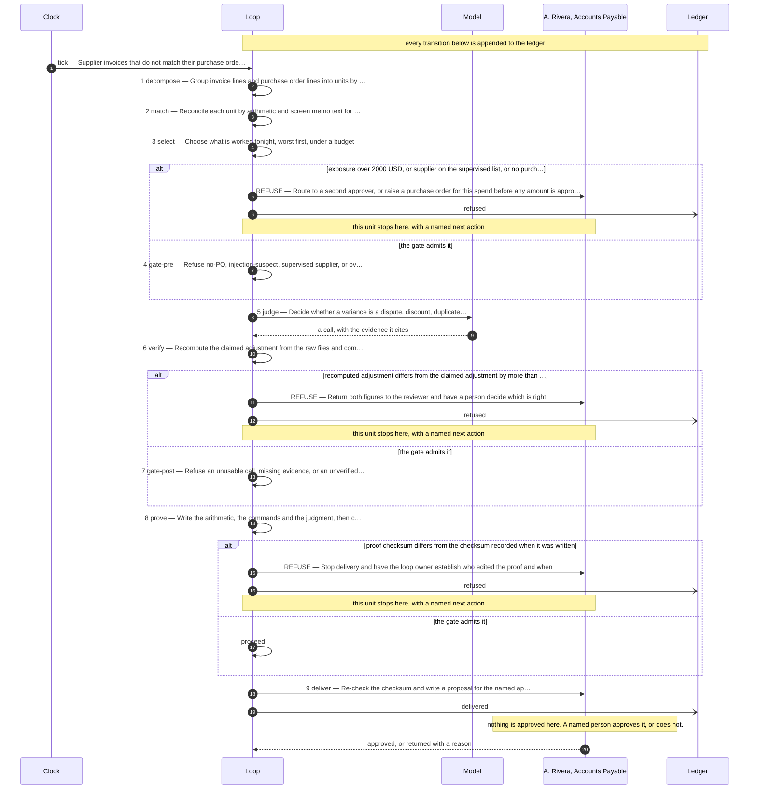

# The design this loop was built from

**Use case:** Supplier invoices that do not match their purchase order, roughly 400 a month

| | |
|---|---|
| Unit of work | One (supplier, purchase order) pair |
| Approver | A. Rivera, Accounts Payable |
| Fan-out | 7 |
| Exit criterion | Shut down if review minutes per unit exceeds 4 for two consecutive weeks |

## Assumptions this design rests on

- Invoice and purchase order lines are retrievable from the ERP as structured records
- A supplier reusing a purchase order number across periods is out of scope for now
- Tolerance limits are set by finance policy and reviewed quarterly
- The supervised supplier list is maintained by the contract owner, not by this loop

## The flow

## The KPIs it is governed by

| KPI | Kind | Baseline |
|---|---|---|
| cost per completed decision | cost | unmeasured |
| escaped defect rate | quality | 0 known in the last quarter |
| review minutes per unit | throughput | 9 minutes manual |
| refusal rate | control | not applicable before this loop |

Regenerate this file by re-running the scaffolder. Edit `design/loop.design`, never this.
