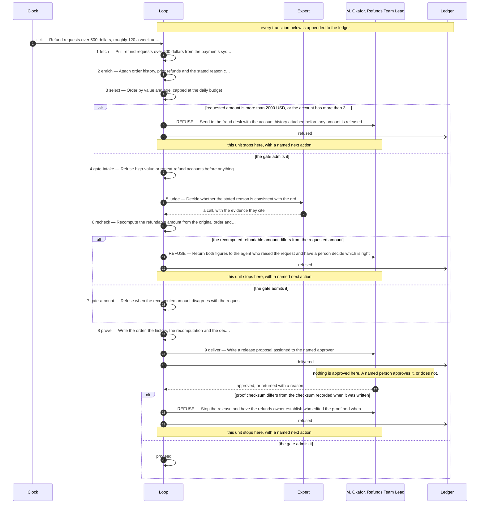

# The design this loop was built from

**Use case:** Refund requests over 500 dollars, roughly 120 a week across three storefronts

| | |
|---|---|
| Unit of work | One refund request, with the order it refers to |
| Approver | M. Okafor, Refunds Team Lead |
| Fan-out | 10 |
| Exit criterion | Shut down if wrong refunds released exceeds 1 in any quarter |

## Assumptions this design rests on

- Order history and prior refunds are retrievable from the payments system by account
- The reason code is chosen by the agent raising the request, not by the customer
- Storefront refund policy is identical across all three brands

## The flow

## The KPIs it is governed by

| KPI | Kind | Baseline |
|---|---|---|
| cost per completed decision | cost | unmeasured |
| wrong refunds released | quality | 2 in the last quarter |
| days from request to release | throughput | 6 days |
| refusal rate | control | not applicable before this loop |

Regenerate this file by re-running the scaffolder. Edit `design/loop.design`, never this.
