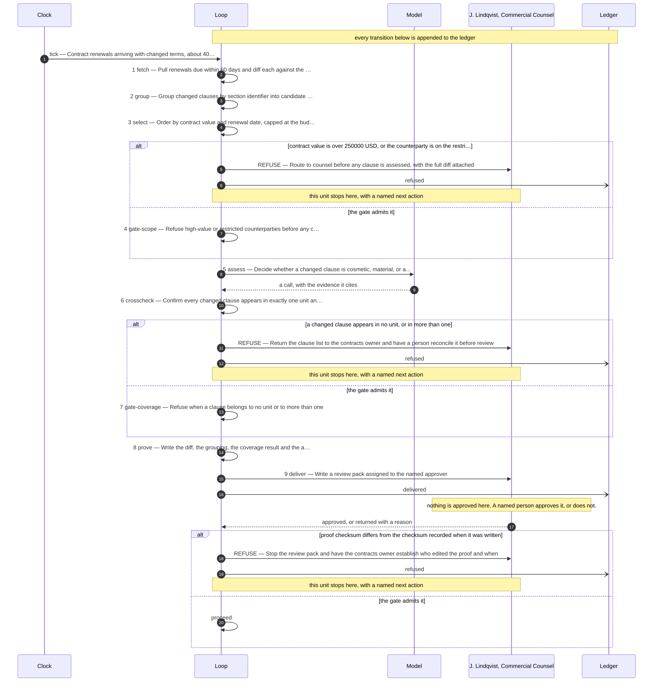

# The design this loop was built from

**Use case:** Contract renewals arriving with changed terms, about 40 a quarter

| | |
|---|---|
| Unit of work | One renewal, with its changed clauses grouped by the obligation they affect |
| Approver | J. Lindqvist, Commercial Counsel |
| Fan-out | 4 |
| Exit criterion | Shut down if a material change is missed more than 1 time in any 12 months |

## Assumptions this design rests on

- The signed version of every contract is retrievable and is the correct comparison baseline
- Clause section identifiers are stable between the signed version and the renewal
- Counterparties send renewals as text, not as scanned images

## The flow

## The KPIs it is governed by

| KPI | Kind | Baseline |
|---|---|---|
| cost per completed decision | cost | unmeasured |
| material changes missed | quality | 1 in the last 12 months |
| days from receipt to counsel review | throughput | 11 days |
| refusals per 100 renewals | control | not applicable before this loop |

Regenerate this file by re-running the scaffolder. Edit `design/loop.design`, never this.
