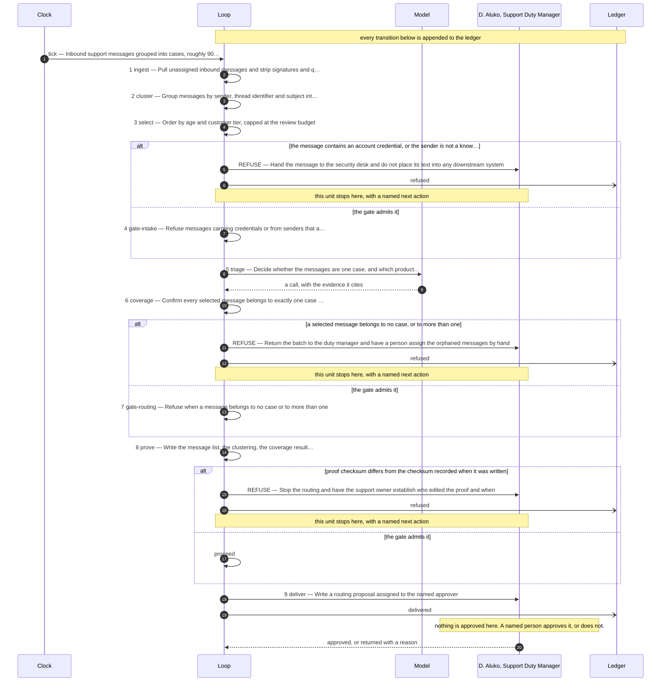

# The design this loop was built from

**Use case:** Inbound support messages grouped into cases, roughly 900 a week

| | |
|---|---|
| Unit of work | One case, being the set of messages about a single problem from one customer |
| Approver | D. Aluko, Support Duty Manager |
| Fan-out | 3 |
| Exit criterion | Shut down if misrouted cases exceeds 15 percent in any month |

## Assumptions this design rests on

- Messages arrive with a thread identifier the mail system sets and does not reuse
- Customer tier is retrievable from the account system at ingest time
- Attachments are not read by this loop in its first version

## The flow

## The KPIs it is governed by

| KPI | Kind | Baseline |
|---|---|---|
| cost per completed decision | cost | unmeasured |
| misrouted cases | quality | 12 percent last quarter |
| hours to first response | throughput | 9 hours |
| refusal rate at intake | control | not applicable before this loop |

Regenerate this file by re-running the scaffolder. Edit `design/loop.design`, never this.
