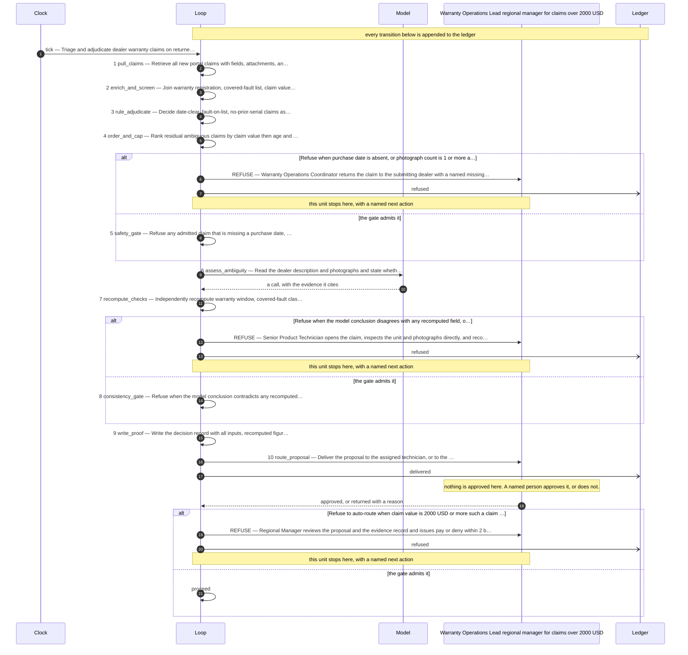

# The design this loop was built from

**Use case:** Triage and adjudicate dealer warranty claims on returned hardware, routing only genuinely ambiguous claims to a product expert.

| | |
|---|---|
| Unit of work | One warranty claim, identified by claim number, for one serial number. |
| Approver | Warranty Operations Lead (regional manager for claims over 2000 USD) |
| Fan-out | 60 |
| Exit criterion | Shut down the loop if expert-review referral rate exceeds 30 percent of claims for two consecutive months, or if reversal rate on auto-approved claims exceeds 2 percent. |

## Assumptions this design rests on

- The dealer portal exposes each claim as a record with claim number, serial, dealer id, fault description text, purchase date, submission date, and zero or more photograph attachments, retrievable by query.
- A serial-to-warranty-registration table exists and gives sale date and warranty term per serial; warranty window is computed as purchase date plus term.
- A written covered-fault list exists and can be encoded as a keyword-and-category mapping; wear-and-tear exclusions are on the same list.
- Claim value is available at submission time, or is computed from a parts-and-labor price table keyed by fault category; assumed available before adjudication.
- Assumed a duplicate-claim check keyed on serial across all historical claims regardless of claim number, since the two known double-payment incidents used different claim numbers on the same serial.
- Assumed a single-approver cap of 2000 USD, taken directly from the description; claims at or above this route to the regional manager.
- Assumed the "roughly one in six" hard-claim rate (approximately 17 percent) as the expected referral baseline, giving about 42 of 250 monthly claims.
- Assumed photographs are machine-retrievable image files, and that impact-damage assessment from photographs is a judgment a rule cannot make.
- Assumed dealer-written fault descriptions are untrusted external text and must be screened before any model reads them.
- Assumed a monthly volume of 250 claims and a working cap of 60 model-assessed claims per month, above the 42 expected, to absorb variance without unbounded spend.
- Assumed technicians remain in the loop as the approving humans; the loop proposes, it does not pay.
- Assumed no instruction embedded in a dealer description is ever executed; none was observed in the supplied text.

## The flow

## The KPIs it is governed by

| KPI | Kind | Baseline |
|---|---|---|
| cost_per_claim_decided | cost | unmeasured |
| model_spend_per_month | cost | unmeasured |
| auto_approval_reversal_rate | quality | unmeasured |
| duplicate_serial_payments | control | 2 known incidents to date |
| days_submission_to_decision | throughput | 8 days |
| expert_referral_rate | quality | approximately 17 percent assumed |
| claims_decided_without_model | throughput | unmeasured |

Regenerate this file by re-running the scaffolder. Edit `design/loop.design`, never this.
